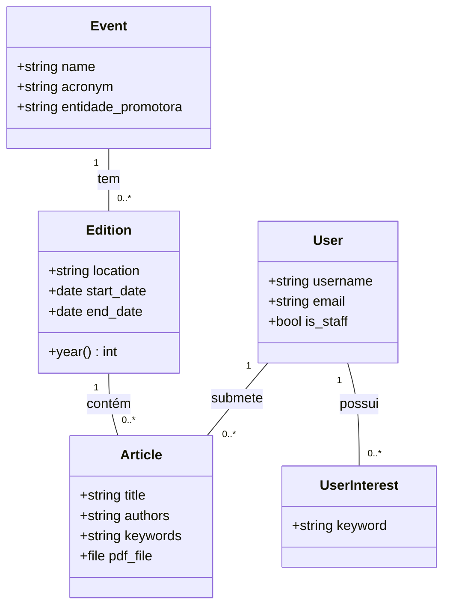
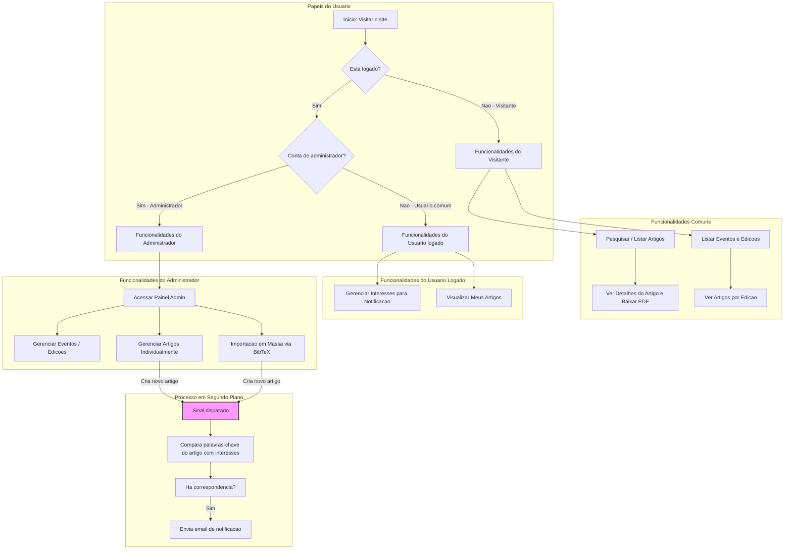

# 📚 Biblioteca Digital de Artigos

Este projeto tem como objetivo desenvolver uma **biblioteca digital** para disponibilizar **acesso fácil e centralizado aos artigos publicados** em determinados eventos científicos. A plataforma será um repositório organizado, permitindo que usuários encontrem e acessem produções acadêmicas de forma eficiente.

Inspirado em plataformas consagradas como a **ACM Digital Library** e a **SBC Open-Lib**, nosso objetivo é criar uma ferramenta robusta para a comunidade acadêmica, facilitando a disseminação do conhecimento científico.

---

## ✨ Funcionalidades Principais

A plataforma conta com um conjunto completo de funcionalidades para administradores e usuários:

- **Gerenciamento de Conteúdo:** Administradores podem cadastrar, editar e remover **eventos, edições e artigos** através de uma interface de administração intuitiva.
- **Importação em Massa:** Suporte para **cadastro de múltiplos artigos de uma só vez** a partir de um arquivo no formato **BibTeX**, agilizando a alimentação do sistema.
- **Busca Avançada:** Usuários podem realizar buscas por **título do artigo, autor ou nome do evento**, encontrando a informação que precisam de forma rápida.
- **Páginas Personalizadas:** Cada evento possui uma página dedicada que lista suas edições, e cada edição lista os artigos correspondentes, criando uma navegação lógica e hierárquica.
- **Área do Usuário:** Usuários registrados possuem uma página pessoal ("Meus Artigos") que organiza os artigos que submeteram, agrupados por ano.
- **Sistema de Notificações:** Os usuários podem se inscrever para receber **notificações por e-mail** sempre que um novo artigo com palavras-chave de seu interesse for publicado.
- **Interface Moderna:** O sistema conta com um **tema claro e escuro (dark mode)**, tanto no site principal quanto no painel de administração, para uma experiência de uso mais confortável.

---

## 👥 Luizs da Equipe e Papéis

| Nome | Matrícula | Papel |
|--------------|------------|-----------|
| Joao Vitor Gomes Mapa da Silva | 2019027695 | Fullstack |
| Luis Henrique Ribeiro Maciel | 2021020759 | Fullstack |
| Seungbin Han | 2025550850 | Fullstack |
| Leonardo Bhering Damasceno | 2020006728 | Fullstack |

---

## 🛠️ Tecnologias Utilizadas

- **Linguagem**: Python 3.12
- **Backend**: Django 5.2
- **Frontend**: HTML + CSS (com Tailwind CSS via CDN)
- **Banco de Dados**: SQLite
- **Agente IA**: Cursor e Gemini

---

## 🚀 Como Executar o Projeto

As instruções detalhadas para configurar o ambiente de desenvolvimento, instalar as dependências e executar o projeto localmente estão disponíveis no arquivo **[how2run.md](./how2run.md)**.

---

## 📌 Backlog do Produto

- **[CONCLUÍDO]** Como administrador, eu quero cadastrar, editar e deletar um evento.
- **[CONCLUÍDO]** Como administrador, eu quero cadastrar, editar e deletar uma nova edição de um evento.
- **[CONCLUÍDO]** Como administrador, eu quero cadastrar, editar e deletar um artigo manualmente, incluindo seu PDF.
- **[CONCLUÍDO]** Como administrador, eu quero cadastrar artigos em massa a partir de um arquivo BibTeX.
- **[CONCLUÍDO]** Como usuário, eu quero pesquisar artigos por título, autor e nome do evento.
- **[CONCLUÍDO]** Como administrador, eu quero que todo evento tenha uma home page com suas edições, e que cada edição tenha uma home page com seus artigos.
- **[CONCLUÍDO]** Como usuário, eu quero ter uma home page com os meus artigos, organizados por ano.
- **[CONCLUÍDO]** Como usuário, eu quero me cadastrar para receber um e-mail sempre que um novo artigo de meu interesse for disponibilizado.

---

## 📆 Backlog da Sprint

### História 1: Como administrador, eu quero cadastrar, editar e deletar um evento e suas edições.
- Criar a estrutura do banco de dados para armazenar eventos e edições. – **[Luiz]**
- Implementar as funcionalidades de gerenciamento no painel de administração. – **[Luiz]**
- Desenvolver as páginas públicas para visualização dos eventos. – **[Luiz]**
- Desenvolver as páginas públicas para visualização das edições. – **[João Vitor]**

### História 2: Como usuário, eu quero pesquisar artigos por título, autor e nome do evento.
- Implementar a interface da barra de busca no frontend. – **[Seungbin]**
- Desenvolver a lógica de busca no backend para consultar o banco de dados. – **[Leonardo]**
- Criar a página de exibição dos resultados da busca. – **[Leonardo]**

### História 3: Como usuário, eu quero ter uma home page com os meus artigos, organizados por ano.
- Implementar a lógica no backend para filtrar os artigos do usuário logado. – **[Leonardo]**
- Desenvolver a funcionalidade de agrupar os artigos por ano de publicação. – **[Luiz]**
- Criar a interface da página "Meus Artigos" para exibir os resultados. – **[João Vitor]**
- Adicionar o link de acesso à página no menu do usuário. – **[João Vitor]**

### História 4: Como administrador, eu quero cadastrar artigos em massa a partir de um arquivo BibTeX.
- Criar a interface de upload de arquivos no painel de administração. – **[João Vitor]**
- Implementar a lógica no backend para ler e interpretar o arquivo BibTeX. – **[João Vitor]**
- Desenvolver a funcionalidade para criar ou associar eventos e edições automaticamente. – **[João Vitor]**
- Implementar a criação dos artigos no banco de dados e fornecer feedback ao administrador. – **[João Vitor]**
- Implementar a funcionalidade de leitura e integração de arquivos PDF e .bib contidos em um arquivo .zip. **[Seungbin]**
- Implementar endpoints de CRUD de artigos no painel de administração. – **[Seungbin]**

---

## 🏛️ Arquitetura do Sistema (UML)

O diagrama de classes abaixo ilustra a estrutura dos principais modelos de dados do sistema e seus relacionamentos.

---

## 🗺️ Fluxograma do Sistema

Este fluxograma descreve o fluxo geral de interações do usuário com a plataforma, desde a navegação básica até as funcionalidades administrativas e processos automatizados.

---
